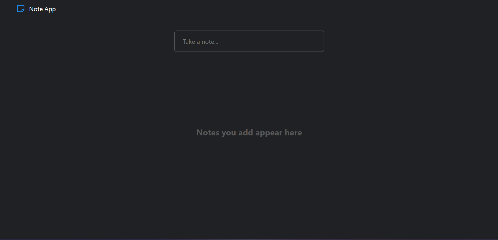
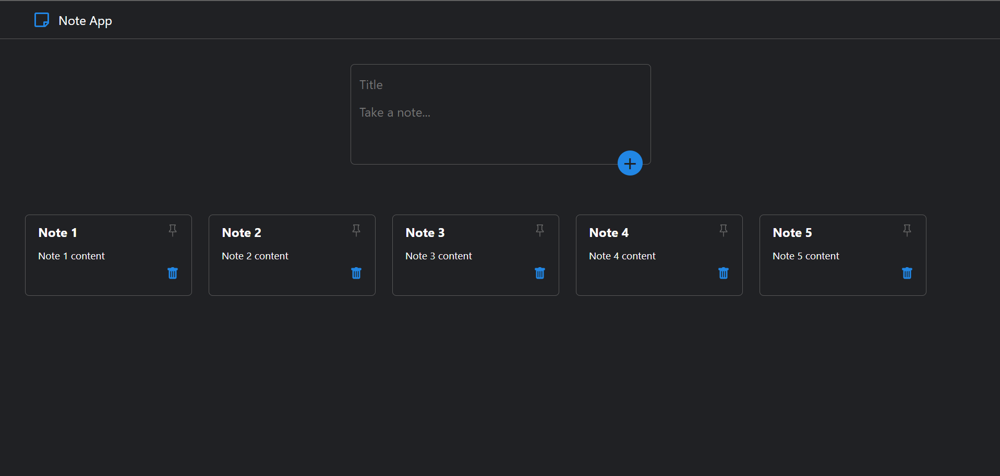
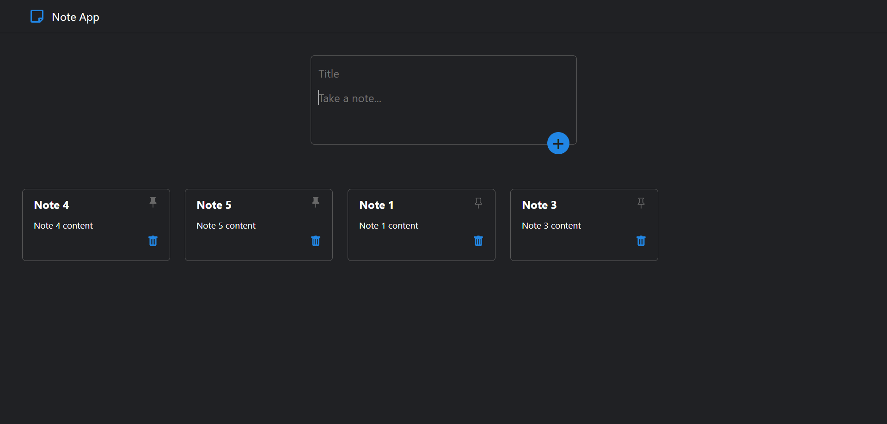

# Note App

A simple note app created using ReactJS that utilizes local storage to store the user's notes.

The note app allows the user to input a note title and note content to add the note to the screen. The user could then delete the note or pin the note which will push the note to the start.

### Start Page

### Add Notes

### Delete and Pin Notes

